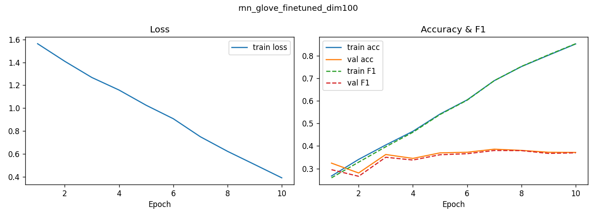
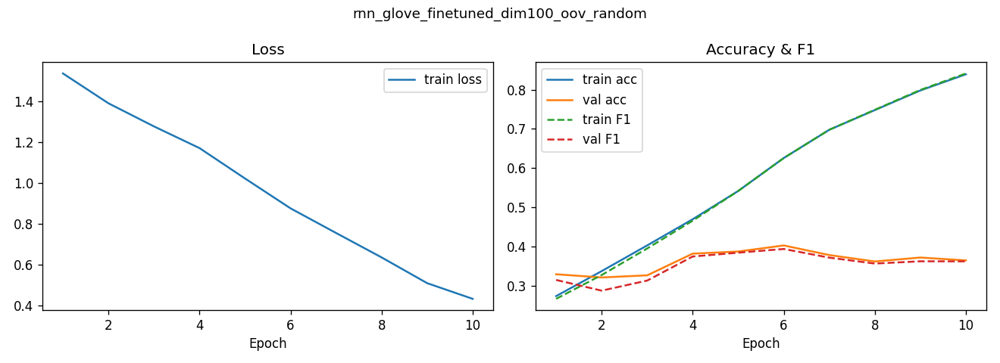
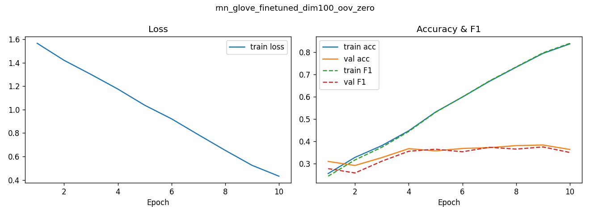
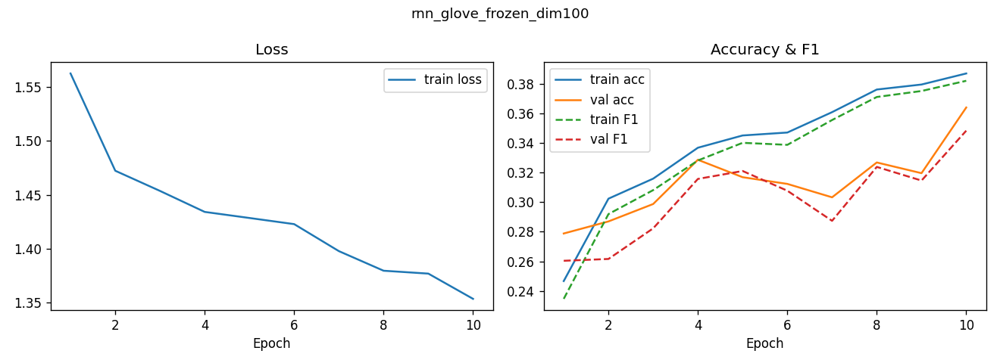
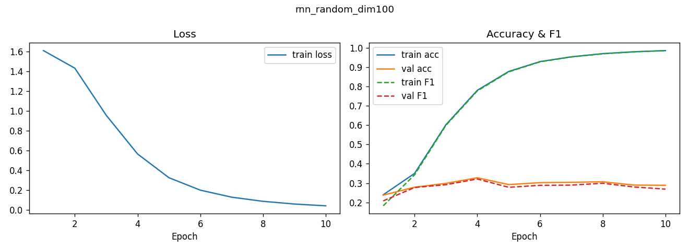

# Sentiment Classification with RNN in PyTorch

A PyTorch implementation of sentiment classification using Recurrent Neural Networks (RNN) and Bidirectional RNN (BiRNN) models. This project trains on the SST-5 movie reviews dataset to classify text as very negative, negative, neutral, positive, very positive.

## Features

- **Two Model Architectures**: Simple RNN and Bidirectional RNN for sentiment analysis
- **Embedding Strategies**: Random embeddings, frozen GloVe embeddings, and fine-tuned GloVe embeddings
- **Automatic Vocabulary Building**: Creates vocabulary from training data with configurable max size
- **Text Preprocessing**: Tokenization, and punctuation filtering
- **Training and Evaluation**: Complete training pipeline with validation
- **Prediction Mode**: Classify sentiment of custom text inputs
- **Checkpoint Saving**: Automatically saves best performing models
- **Ablation Studies**: Experiments over embedding dimensions (50, 100, 200) and OOV handling strategies
- **MLflow Integration**: Experiment tracking and logging
- **GPU Support**: Utilizes CUDA if available

## Installation

1. Clone or download this repository
    ```bash
    git clone https://github.com/bhatishan2003/Sentiment-Classification-with-RNN-in-Pytorch.git
    cd Sentiment-Classification-with-RNN-in-Pytorch
    ```
2. Install dependencies:
    ```bash
    pip install -r requirements.txt
    ```

## Usage

### Training a Model

Train an RNN model for 10 epochs with default settings:

```bash
python sentiment_classifier.py --model rnn --epochs 10
```

Train a BiRNN model with custom hyperparameters:

```bash
python sentiment_classifier.py --model birnn --epochs 20 --batch_size 64 --lr 0.001 --embed_dim 128 --hidden_dim 256
```

### Ablation Studies

Run ablation over embedding dimensions:

```bash
python sentiment_classifier.py --model rnn --ablation_dims --epochs 10
```

Run ablation over OOV handling strategies:

```bash
python sentiment_classifier.py --model birnn --ablation_oov --epochs 10
```

### Making Predictions

You can predict sentiment on custom text using a trained model. Specify the embedding strategy to load the appropriate checkpoint.

Using **RNN**:

```bash
python .\sentiment_classifier.py  --model rnn --predict "This movie was normal. Not quite good"
```

```
--------------------------------------------------------
  Text      : This movie was normal. Not quite good
  Predicted : NEUTRAL
--------------------------------------------------------
  Class probabilities:
    very negative    0.023
    negative         0.094  ###
    neutral          0.814  ############################
    positive         0.066  ##
    very positive    0.002
```

Using **BiRNN**

```bash
python sentiment_classifier.py --model birnn --predict "This film was terrible." --embed_strategy glove_frozen
```

```
--------------------------------------------------------
  Text      : This movie was absolutely fantastic!
  Predicted : VERY POSITIVE
--------------------------------------------------------
  Class probabilities:
    very negative    0.001
    negative         0.000
    neutral          0.003
    positive         0.024
    very positive    0.972  ##################################
```

## Results

### RNN Results

#### Training Curves

**RNN GloVe Finetuned Dim100**


**RNN GloVe Finetuned Dim100 OOV Random**


**RNN GloVe Finetuned Dim100 OOV Zero**


**RNN GloVe Frozen Dim100**


**RNN Random Dim100**


### BiRNN Results

#### Training Curves

**BiRNN GloVe Finetuned Dim100**


**BiRNN GloVe Finetuned Dim100 OOV Random**


**BiRNN GloVe Finetuned Dim100 OOV Zero**


**BiRNN GloVe Frozen Dim100**


**BiRNN Random Dim100**


**BiRNN Random Dim200**


**BiRNN Random Dim50**


## Experiment Tracking

The project uses MLflow for experiment tracking. All runs are logged to the `mlruns/` directory. You can view experiments using:

```bash
mlflow ui --backend-store-uri ./mlruns
```

## Development Notes

- **Pre-commit**

    We use pre-commit to automate linting of our codebase.
    - Install hooks:
        ```bash
        pre-commit install
        ```
    - Run Hooks manually (optional):
        ```bash
        pre-commit run --all-files
        ```

- **Ruff**:
    - Lint and format:
        ```bash
        ruff check --fix
        ruff format
        ```
