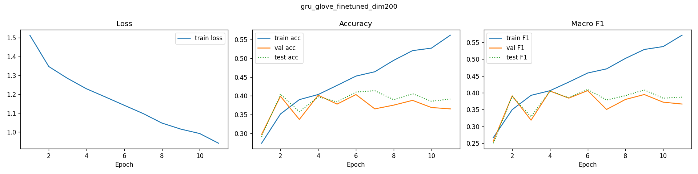
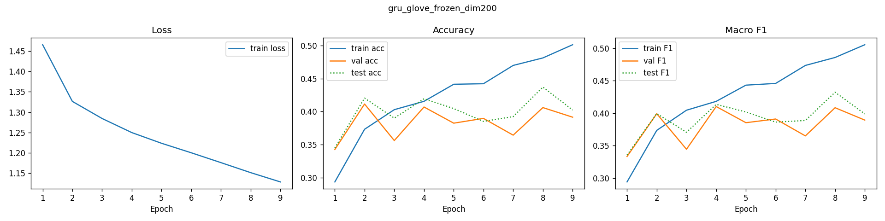
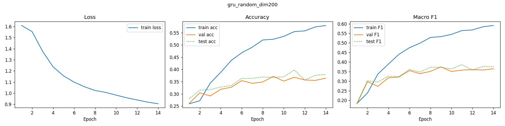
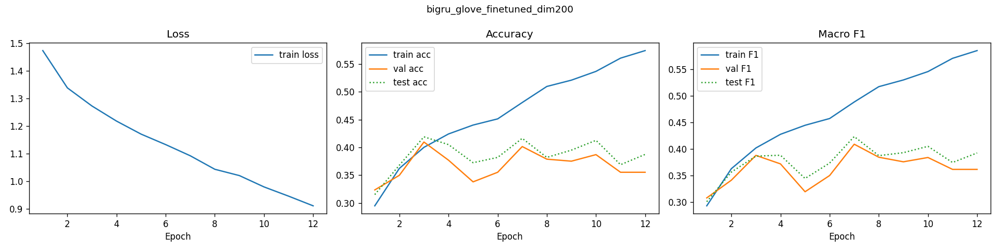
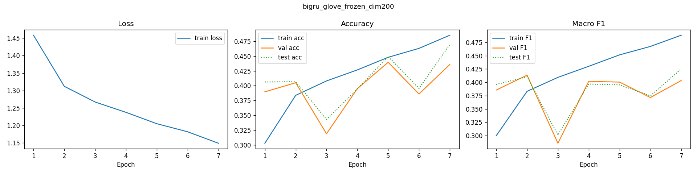
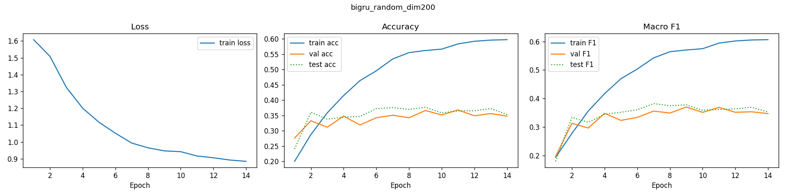

# Human Sentinment Classification (NLP)

A PyTorch implementation of sentiment classification using Recurrent Neural Networks (GRU) and Bidirectional GRU (BiGRU) models. This project trains on the SST-5 movie reviews dataset to classify text as "very negative", negative, neutral, positive, and "very positive".

## Features

- **Two Model Architectures**: Simple GRU and Bidirectional GRU for sentiment analysis
- **Embedding Strategies**: Random embeddings, frozen GloVe embeddings, and fine-tuned GloVe embeddings
- **Automatic Vocabulary Building**: Creates vocabulary from training data with configurable max size
- **Text Preprocessing**: Tokenization, and punctuation filtering
- **Training and Evaluation**: Complete training pipeline with validation
- **Prediction Mode**: Classify sentiment of custom text inputs
- **Checkpoint Saving**: Automatically saves best performing models
- **Ablation Studies**: Experiments over embedding dimensions (50, 100, 200) and OOV handling strategies
- **MLflow Integration**: Experiment tracking and logging
- **GPU Support**: Utilizes CUDA if available

## Installation

1. Clone or download this repository
    ```bash
    git clone https://github.com/bhatishan2003/Sentiment-Classification-with-GRU-in-Pytorch.git
    cd Sentiment-Classification-with-GRU-in-Pytorch
    ```
2. Install dependencies:
    ```bash
    pip install -r requirements.txt
    ```

## Usage

### Training a Model

Train an GRU model for custom hyperparameters

```bash
python sentiment_classifier.py --model gru --epochs 15  --hidden_dim 256 --dropout 0.25 --lr 0.001 --batch_size 64 --patience 5 --embed_dim 200
```

Train a BiGRU model with custom hyperparameters:

```bash
python sentiment_classifier.py --model bigru --epochs 20 --batch_size 64 --lr 0.001 --embed_dim 200 --hidden_dim 256
```

### Making Predictions

You can predict sentiment on custom text using a trained model. Specify the embedding strategy to load the appropriate checkpoint.

Using **GRU**:

```bash
python sentiment_classifier.py --model gru --predict "The film was amazing" --embed_dim 200 --hidden_dim 256
```

Example output:

```text
Text      : The film was amazing
Predicted : VERY POSITIVE

Class probabilities:
  very negative: 0.159
  negative     : 0.125
  neutral      : 0.140
  positive     : 0.244
  very positive: 0.333
```

Using **BiGRU**:

```bash
python sentiment_classifier.py --model bigru --predict "This is probably one of the worst films ever." --embed_dim 200 --hidden_dim 256
```

```
--------------------------------------------------------
  Text      : This is probably one of the worst films ever.
  Predicted : VERY NEGATIVE
--------------------------------------------------------
  Class probabilities:
    very negative    0.947  #################################
    negative         0.044  #
    neutral          0.007
    positive         0.002
    very positive    0.001
```

## Results

### GRU and BiGRU Results (available assets)

#### Training Curves (Dimension 200)

**GRU GloVe Finetuned Dim200**


**GRU GloVe Frozen Dim200**


**GRU Random Dim200**


**BiGRU GloVe Finetuned Dim200**


**BiGRU GloVe Frozen Dim200**


**BiGRU Random Dim200**


## Experiment Tracking

The project uses MLflow for experiment tracking. All runs are logged to the `mlruns/` directory. You can view experiments using:

```bash
mlflow ui --backend-store-uri ./mlruns
```

## Development Notes

- **Pre-commit**

    We use pre-commit to automate linting of our codebase.
    - Install hooks:
        ```bash
        pre-commit install
        ```
    - Run Hooks manually (optional):
        ```bash
        pre-commit run --all-files
        ```

- **Ruff**:
    - Lint and format:
        ```bash
        ruff check --fix
        ruff format
        ```
